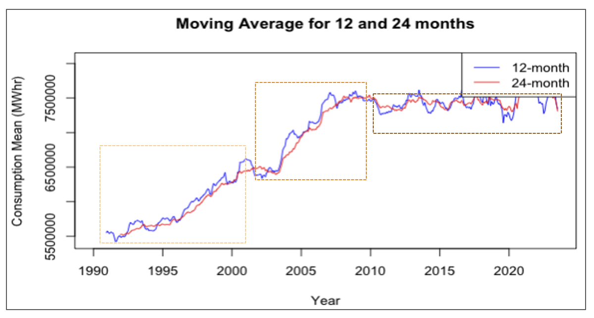

# energy-forecasting
As a part of a graduate course in Time Series Analysis, my teammates (Claire Boyd, Kathryn Link-Oberstar, Megan Moore) and I built forecasting models to predict monthly residential electricity consumption in California. 

## Resources:
* [Final Presentation](ca_forecasting_final_deck.pdf)
* [pdf of R code](code_sample_R_time_series.pdf) 

## Key details:

* **Consumption Patterns**: We found 3 distinct consumption patterns from 1990-2005, from 2005-2010, and from 2010-2019. The first could be tied to population, economic growth, the second to policy changes around appliances and incentives and the last to larger initiatives around renewable energy and public awarenesss

* **Forecasting Models**: We explored ETS, Regression, Seasonal Arima, Fourier Transforms to build simple forecasting models that could be used to predict monthly consumption patterns. Regression with ARIMA on errors worked best with no autocorrelation in residuals. 

* **Key variables**: In our regression model, we found consumption to be dependent on consumers, price, heating and cooling days. Other variables we explored were natural gas consumption, precipitation, minimum and maximum temperatures 